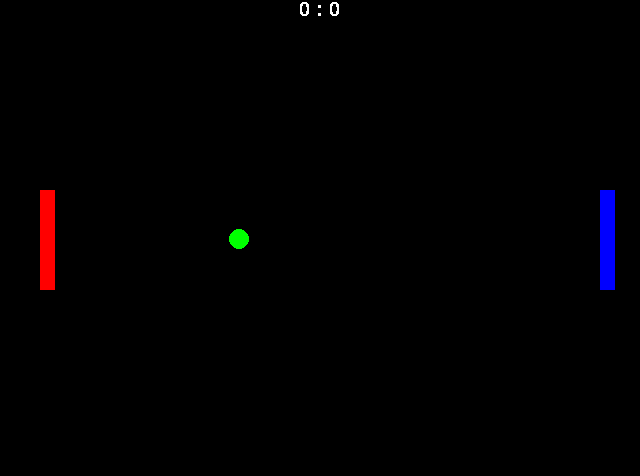
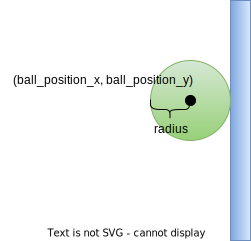
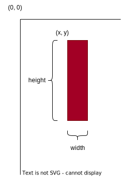

# Disclaimer

In diesem Übungsblatt werden folgende Symbole verwendet:

* \hint FYI - Hier erhalten sie weiterführende, informative Hinweise.
* \warning Wichtige Inhalte - hier ist aufmerksames Lesen geboten.
* \task Hier müssen Sie aktiv werden - Es folgen Aufgaben, die Sie bearbeiten sollen.

# Pygame

Im Rahmen dieser Übung verwenden wir die Spiele-Bibliothek `pygame`.
Diese ist im Vergleich zu modernen Spieleentwicklungsplattformen wie Unity eher rudimentär ausgestattet.
Dafür ist `pygame` auf Grund der Einfachheit gut geeignet die grundlegenden Konzepte von Computerspielen zu verstehen. 

# Pong

In dieser Übung soll das Spiel Pong entwickelt werden.
Bei diesem Klassiker fliegt ein Ball durch das Spielfeld.
Jeder Spieler hat ein Paddel, das er mit Hilfe der Tastatur nach oben, oder unten bewegen kann.
Ziel ist es den Ball 10 Mal hinter das gegnerische Paddel zu bringen. Folgender Screenshot zeigt das Endergebnis der Entwicklung:

{width=60%}


## Divide and Conquer

Diese Aufgabe ist durchaus komplex, kann aber durch die Aufteilung des Problems in Einzelschritte von Ihnen gelöst werden. 

Die Einzelschritte sind gegeben durch:
 
1. Diagonale Bewegung des Balls
1. Geschwindigkeit des Balls
1. Abprallen des Balls an der Wand
1. Aktualisierung der Ball-Position auf Basis der vergangenen Zeit
1. Erstellen eines `ball` Dictionaries
1. Refaktorisieren in Funktionen
1. Zeichnen eines Paddels an eine feste Position
1. Bewegung eines Paddels mittels Tastatur
1. Kollisionsprüfung mit Paddel
1. Erweiterung um das zweite Paddel
1. Ermitteln und Anzeigen der Score

## Diagonale Bewegung des Balls

Gegeben ist ein Programm, welches aktuell 

* `pygame` initialisiert,
* ein Fenster einer definierten Größe erstellt, 
* bestimmte Events behandelt und
* einen Kreis an eine feste Position zeichnet.

\task Lesen Sie zunächst den gegebenen Source Code und verstehen Sie die einzelnen Teile. Bemühen Sie hierzu auch die Vorlesungsfolien. 


\task Führen Sie zwei Variablen `ball_position_x` und `ball_position_y` ein, welche die x- und die y-Koordinaten des Ballmittelpunkts speichern.
Verwenden Sie die neuen Variablen beim Zeichnen des Kreises.
Erweitern Sie das Programm nun so, dass sich der Ball bei jedem Schleifendurchlauf (d.h. pro Frame) um zehn Pixel nach rechts und zehn Pixel nach unten bewegt. 

Der Ball sollte nun diagonal nach rechts unten fliegen. 
Der Ball verlässt aktuell noch den Bildausschnitt.

## Eine Geschwindigkeit für den Ball

\task Definieren Sie nun zwei Variablen `ball_speed_x` und `ball_speed_y`, welche die Geschwindigkeit in x- und y-Richtung speichern. 
Beide Variablen sollen zu Beginn den Wert `10` haben (die Einheit ist noch Pixel pro Frame).
Verwenden Sie die Variablen an den Stellen, an denen Sie die neue Position des Balls berechnen.

## Abprallen des Balls

In dieser Teilaufgabe soll nun verhindert werden, dass der Ball aus dem Bildbereich fliegt. 

\task Kehren Sie die x-Geschwindigkeit des Balls um (Änderung des Vorzeichens), wenn die x-Position des Balls größer ist, als das Fenster breit ist, bzw. die x-Position des Balls kleiner als null ist. Die Breite des Fensters ist gegeben mit `WINDOW_WIDTH`.

\task Führen Sie die gleichen Überprüfungen für die y-Koordinate ein. Die Höhe des Fensters ist gegeben mit `WINDOW_HEIGHT`.

Nun sollte der Ball durch das Fenster fliegen und an den Rändern abprallen.
Ein Problem ist aber vermutlich noch, dass der Ball immer noch kurz teilweise am Bildschirmrand eintaucht.
Das liegt daran, dass `ball_position_x` und `ball_position_y` den Mittelpunkt des Kreises beschreiben. 
Die Abbildung \ref{fig:collision} zeigt den Zeitpunkt, zu dem der Ball den rechten Rand berührt und auch abprallen sollte.



\task Überlegen Sie sich (z.B. auf auf einem Blatt Papier), wie Sie Ihre Überprüfung der Position erweitern müssen, sodass der Radius des Balls berücksichtigt wird.
Erweitern Sie das Programm entsprechend, sodass der Ball auf keiner Seite mehr eintaucht.

## Berücksichtigung der vergangenen Zeit

Wie in der Vorlesung besprochen kann der aktuelle Code dazu führen, dass der Ball sich ungleichmäßig bewegt und die Bewegung je nach PC unterschiedlich schnell abläuft. 

Die Funktion `clock.tick(60)` liefert die vergangene Zeit seit dem letzten Aufruf der Funktion zurück. 
Die Einheit von `delta_t` ist Millisekunden.

\task Ändern Sie die zwei Variablen `ball_speed_x` und `ball_speed_y` ab und weisen ihnen jeweils den Wert `150` zu.

\task Berechnen Sie die aktuelle Position des Balls auf Basis der aktuellen Geschwindigkeit (`ball_speed_x` und `ball_speed_y`), der vergangenen Zeit `delta_t` und der aktuellen Position (`ball_position_x` und `ball_position_y`). 
Sie finden hierzu einige Informationen in den Vorlesungsfolien.

\warning Die Einheit von `ball_position_x` und `ball_position_y` ist Pixel pro Sekunde. Die Einheit von `delta_t` ist Millisekunden. Die Einheit von `ball_position_x` und `ball_position_y` ist Pixel.

Der Ball sollte sich nun nach wie vor im Fenster bewegen und an den Fensterrändern abprallen.
Der Unterschied ist, dass die Geschwindigkeit in der Einheit Pixel pro Sekunde angegeben wird und nicht mehr in Pixel pro Frame.
Somit sollte die Animation auf jedem PC gleich schnell ablaufen.

\newpage
## Sammeln der Eigenschaften in einem Dictionary

Wenn wir so weiterprogrammieren wie bisher, haben wir in unserem Programm bald sehr schnell sehr viele einzelne Variablen.
Viele dieser Variablen gehören thematisch zusammen. 

Der Ball wird im Spiel folgende Eigenschaften haben:

* *position*: Position des Balls als Liste, wobei der erste Eintrag der x-Koordinate des Balls entspricht und der zweite Eintrag der y-Koordinate.
* *speed*: Geschwindigkeit des Balls (und damit auch Richtung) als Liste. Der erste Eintrag entspricht der Geschwindigkeit in x-Richtung, der zweite Wert der Geschwindigkeit in y-Richtung. 
* *radius*: Der Radius des Balls, z.B. `10`.
* *color*: Die Farbe des Balls als RGB-Tupel. `(0, 255, 0)` entspricht z.B. der Farbe Grün.

Wir wollen alle diese Eigenschaften in einem Dictionary (Wörterbuch) namens `ball` bündeln.
Folgender Code zeigt anhand der Eigenschaft `position`, wie das gemeint ist:

```python
ball = {
    "position": [50.0, 50.0] # center
}
```

\task Erweitern Sie den Code um die geforderten restlichen Eigenschaften.
Verwenden Sie die neue Datenstruktur in Ihrem Programm und ersetzen Sie `ball_position_x`, `ball_position_y`, `ball_speed_x` und `ball_speed_y` in Ihrem Programm mit der neuen Datenstruktur. 

**Achtung Spoiler:**

`ball_position_x` muss dann z.B. durch `ball["position"][0]` ersetzt werden.

## Auslagern in Funktionen

Ihre `main`-Funktion ist mittlerweile schon deutlich zu lang geworden. Es sollen nun Teile in Funktionen ausgelagert werden, um so den Code wieder übersichtlicher zu machen und Details zu abstrahieren.

\hint Erstellen Sie vor der Umstrukturierung eine Sicherheitskopie von Ihrem Code. 
So können Sie jederzeit zum ursprünglichen Code zurückkehren.

\task Definieren Sie zwei Funktionen und lagern Sie den entsprechenden Code aus der `main` in die Funktionen aus:

* `update_ball`: Bekommt `delta_t` und `ball` übergeben und aktualisiert in `ball` die Position. In der Funktion wird auch die Kollision mit den Wänden geprüft.
* `draw_ball`: Bekommt `screen` und `ball` übergeben und zeichnet den Ball anhand der Eigenschaften von `ball`.

Jetzt sollte Ihre Hauptschleife wieder deutlich übersichtlicher sein. 
Das Verhalten sollte sich natürlich durch die Umstrukturierung nicht geändert haben.

## Das erste Paddel

Analog zu `ball` hat ein Paddel folgende Eigenschaften:

* *position*: Position des Paddels als Liste, wobei der erste Eintrag der x-Koordinate der linken, oberen Ecke des Paddels entspricht und der zweite Eintrag der y-Koordinate der linken, oberen Ecke des Paddels.
* *speed*: Geschwindigkeit des Paddels (und damit auch Richtung) als Liste. Der erste Eintrag entspricht der Geschwindigkeit in x-Richtung, der zweite Wert der Geschwindigkeit in y-Richtung. Das Paddel soll sich aber nur in y-Richtung bewegen können, d.h. die x-Koordinate wird immer `0` sein.
* *width*: Breite des Paddels, z.B. `15`.
* *height*: Höhe des Paddels, z.B. `100`.
* *color*: Die Farbe des Balls als RGB-Tupel. `(255, 0, 0)` entspricht z.B. der Farbe Rot.

Folgende Grafik zeigt wie die Koordinaten zu verstehen sind:

{width=30%}

\task Erstellen Sie analog zu `ball` das Dictionary `paddle1` für das linke Paddel. Das Paddel soll zu Beginn vertikal zentriert sein. Der Abstand vom linken Fensterrand soll 40 Pixel groß sein.

\task Schreiben Sie eine Funktion `draw_paddel`, welcher `screen` und das Dictionary `paddle` übergeben wird. Die Funktion soll das Rechteck basierend auf den im Dictionary enthaltenen Daten in das Fenster zeichnen.

## Move it!

Im nächsten Schritt wollen wir Spieler 1 ermöglichen, das Paddel zu bewegen. 

\task Erweitern Sie die Funktion `handle_keys` um den Übergabeparameter `paddle1`. Reagieren Sie in der Funktion auf Tastendrücke wie folgt:

* wird `pygame.K_UP` gedrückt, soll die Geschwindigkeit von `paddle1` auf `-200` gesetzt werden. Wird die Taste wieder losgelassen soll die Geschwindigkeit auf `0` gesetzt werden.
* wird `pygame.K_DOWN` gedrückt, soll die Geschwindigkeit von `paddle1` auf `200` gesetzt werden. Wird die Taste wieder losgelassen soll die Geschwindigkeit auf `0` gesetzt werden.

Nun sollte durch das Drücken der Tasten die Geschwindigkeit des Paddels beeinflusst werden können.
Damit sich das Paddel auch bewegt müssen wir die Position des Paddels noch aktualisieren.

\task Schreiben Sie eine Funktion `update_paddle`, welcher `delta_t` und `paddle` übergeben werden.
In der Funktion soll die Position des Paddels auf Basis der vergangenen Zeit und der Geschwindigkeit des übergebenen Paddels aktualisiert werden.
Überlegen Sie sich außerdem, wie sie verhindern können, dass das Paddel aus dem Fenster herausbewegt werden kann. 
Implementieren Sie Ihre Idee.

## Kollision mit dem Paddel

Aktuell fliegt der Ball einfach durch das Paddel hindurch. 
Das wollen wir in dieser Aufgabe ändern. 

Im Modul `collision.py` existiert hierfür bereits eine Funktion `get_collision_side`. 
Mit Hilfe dieser Funktion können Sie bestimmen, auf welcher Seite der Ball mit dem Paddel kollidiert.
Die Funktion liefert entweder `"left"`, `"right"`, `"top"`, `"bottom"` oder, falls Ball und Paddel sich nicht berühren, `"none"` zurück.

\task Erweitern Sie die Funktion `update_ball` um den Übergabeparameter `paddle1`. Bestimmen Sie die Seite der Kollision und reagieren Sie wie folgt:

* Kehren Sie die Geschwindigkeit des Balls im Falle einer Kollision um (x- oder y-Richtung, je nach Kollisionsseite).
* Setzen Sie die Position des Balls auf die Kollisionsseite des Paddels, aber außerhalb mit kleinem Sicherheitsabstand (z.B. `5` Pixel). 
Damit vermeiden Sie, dass der Ball in das Paddel eintaucht und dann am Paddel kleben bleibt.
* Nur wenn keine Kollision vorliegt, soll die Position des Balls um die auf Basis von `ball["speed"]` und `delta_t` berechnete Strecke verändert werden.

Eventuell bedarf der implementierte Algorithmus etwas Fine-Tuning. 
Testen Sie ausgiebig.

## Ein Paddel kommt selten allein

\task Erweitern Sie nun den Code um das zweites Paddel `paddle2`. 
Beachten Sie, dass nur die Funktionen `handle_keys` und `update_ball` jeweils `paddle2` als zusätzlichen Übergabeparameter brauchen.
Die anderen Funktionen sollten einfach zweimal aufgerufen werden können: einmal mit `paddle1` und einmal mit `paddle2`.

\hint Verwenden Sie z.B. die Tasten `pygame.K_w` und `pygame.K_s` für das zweite Paddel.

## Score anzeigen

Um in Pygame Text auszugeben, muss man zunächst eine Schrift laden. Das macht man einmal, d.h. oberhalb der Hauptschleife:

```python
my_font = pygame.font.SysFont('Comic Sans MS', 30)
```

Nun kann man bei jedem Schleifendurchlauf einen Schriftzug in einen separaten Grafikspeicher zeichnen und diesen dann an die gewünschte Stelle im Fenster kopieren (auch blitting genannt):

```python
text_surface = my_font.render("0 : 0", False, (255, 255, 255))
screen.blit(text_surface, (0,0))
```

\task Erweitern Sie das Spiel um die Anzeige der Score. Die Anzeige soll horizontal zentriert im oberen Bereich erscheinen und den Spielstand (z.B. `4 : 3`) anzeigen.

\hint Sie können die Breite des gerenderten Textes mittels `text_surface.get_width()` herausfinden.

\task Prüfen Sie die Position des Balls: ist der Ball hinter dem linken oder rechten Paddel soll die Score des jeweiligen Spielers erhöht werden.
Der Ball soll in die Mitte des Fensters zurückgesetzt werden. 
Das Spiel soll direkt weitergehen.

## Let's Play 

Glückwunsch!
Sie sollten nun Ihr erstes grafisches Computerspiel programmiert haben.
